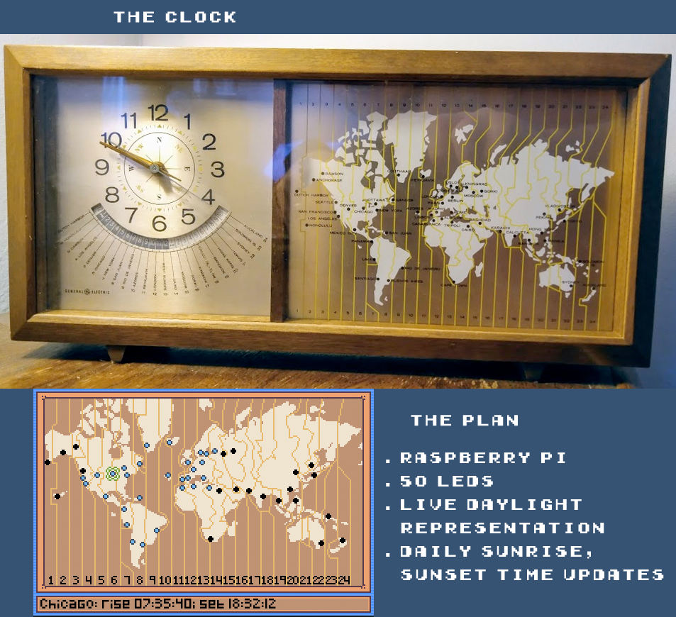

# Daylight Clock

I found this old GE clock in an antique store a couple years ago. It's about the size of a shoe box.

Most of the thing is dedicated to a Mercator projection of the world, featuring prominent timezone demarcations and 50 little black dots designating cities and islands of interest to the clock-buying businessman of 1970 or so (including some charming anachronisms like "Peking" and "Leningrad").

I bought it thinking the dots were actually holes punched in the map, which would be illuminated or darkened according to the time of day at each locale, but alas upon closer inspection they're just dabs of black paint. However the box this thing is mounted in is actually quite deep (and mostly empty space), and I had the realization that I could just put a Raspberry Pi inside, drill a few dozen holes in the map plate and wire it up with some LEDs myself.

Currently this repo is a proof-of-concept in the form of a Pygame-powered pixel version of the clock's map (made with [Aseprite](https://github.com/aseprite/aseprite)). It pulls sunset and sunrise times from the [Sunrise and sunset times API](https://sunrise-sunset.org/api), saves them daily as a JSON file, and turns "on" (blue) and "off" (black) the little pixel icons in real time. You can also scroll left and right with your arrow keys to view each location's name along with its next sunrise and sunset times.

### Try it out:

`python3 src\pygame_ui.py`